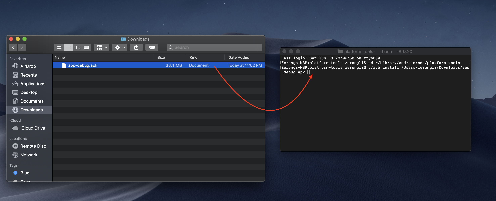
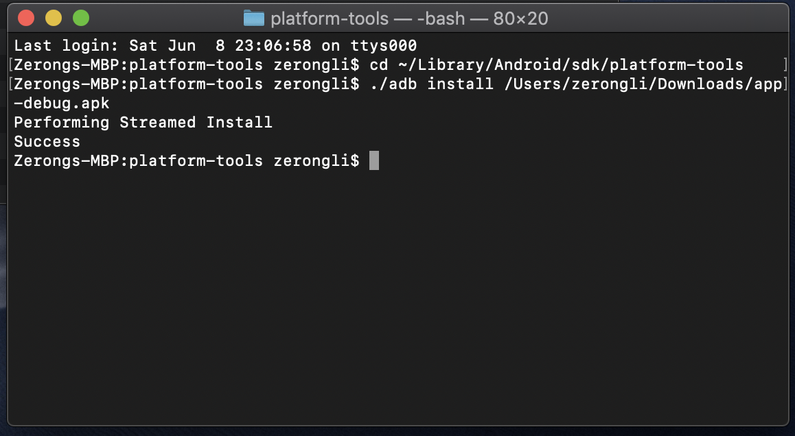
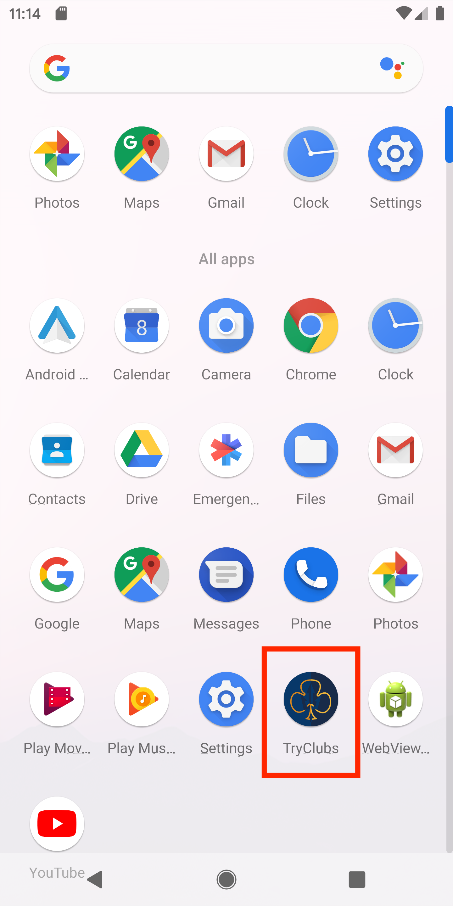

#  
 
 Team S.U.C.C. #28, CSE 110 UCSD, Spring 2019.
 
## Introduction
TryClubs is the go-to mobile application for finding and advertising student organizations. Enough with the paper adverts loitered around campus. Enough with the absurd amount of flyers getting shoved in your face on Library Walk. Enough with feeling lost in how to get involved. TryClubs will put an end to UCSD’s “UC Socially Dead” reputation by introducing students to their niches. We provide a user friendly interface for users to browse through and favorite clubs, a timeline feature that keeps users updated on club events, and a tagging feature that integrates seamless searching and organization of clubs.

## Installation Instructions (Mac)
  1. [Click here to download the apk file](https://drive.google.com/open?id=1qCaEodWc5qqhxDT961YV4JrHltC0u_EP)
  2. Run the emulator from Android Studio (Pixel 2 XL with Android Pie (API 28) installed is preferred).
  3. Open "Terminal" and run the following 2 lines.
  4. **"cd ~/Library/Android/sdk/platform-tools/"**
  5. **"./adb install "(add a space after "install") and then drag the downloaded apk file from Step 1 to Terminal.**
  6. In Terminal, it should display "Performing Streamed Install Success".
  7. You should be able to find the App in the emulator.
  8. Open the App and enjoy it! (You could check the build version in the App by clicking in the text "What's news" at the top of the Timeline, current newest build version is 1.1.1)
---

