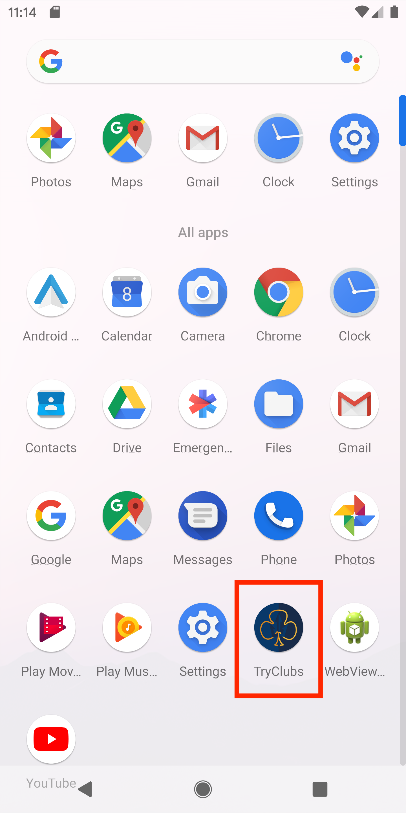

#  
 
 Team S.U.C.C #28, CSE 110, Spring 2019.

## Installation Instruction (Mac)
  1. [Click here to download the apk file](https://drive.google.com/a/ucsd.edu/file/d/1wvQ69oH2kIvkfDhZxvgy_i-lh_NGfzyj/view?usp=drivesdk)
  2. Run the emulator from Android Studio (Pixel 2 XL with Android Pie (API 28) installed is preferred).
  3. Open "Terminal" and run the following 2 lines.
  4. **"cd ~/Library/Android/sdk/platform-tools/"**
  5. **"./adb install "(add a space after install) and then drag the downloaded apk file from Step 1 to Terminal.**
  7. Hit "Enter".
  8. In Terminal, it should display "Performing Streamed Install Success".
  9. You should be able to find the App in the Emulator.
---

